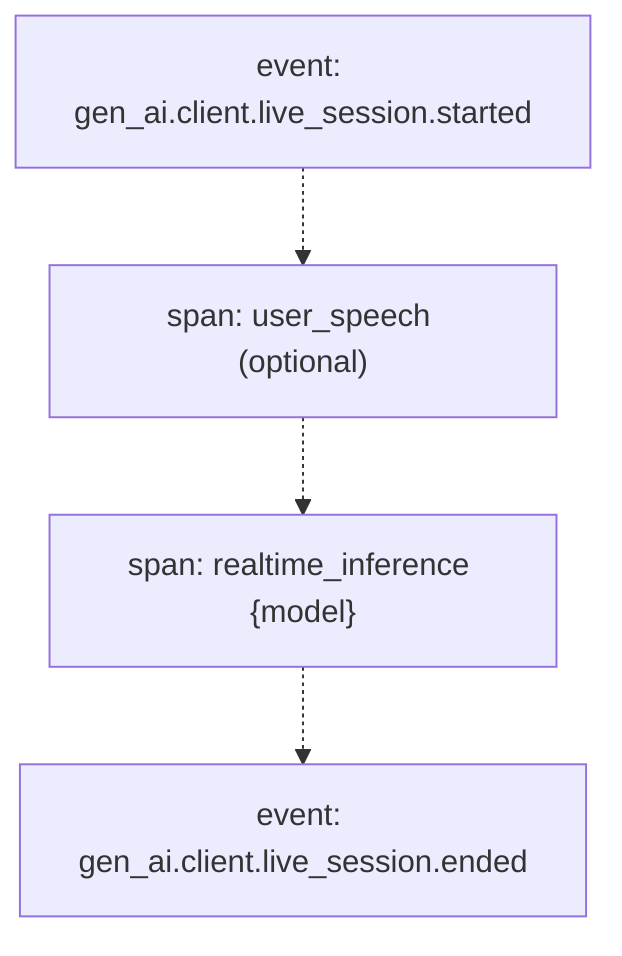
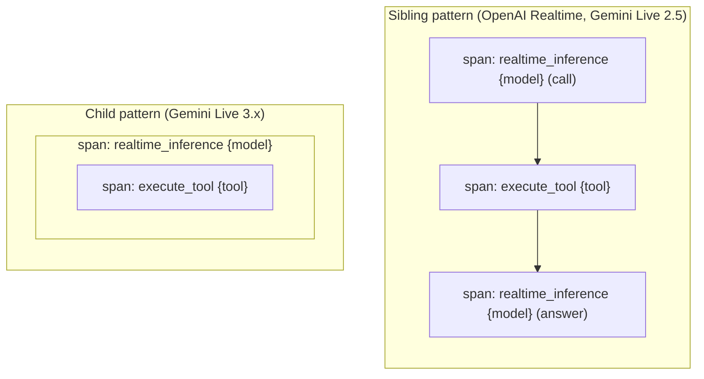

<!--- Hugo front matter used to generate the website version of this page:
linkTitle: Realtime spans
--->

# Semantic conventions for GenAI realtime (live) content generation spans

**Status**: [Development][DocumentStatus]

<!-- toc -->

- [Live content generation](#live-content-generation)
  - [Trace structure](#trace-structure)
  - [User speech span](#user-speech-span)
  - [Open questions](#open-questions)
  - [Other voice-agent vendors](#other-voice-agent-vendors)
    - [ElevenLabs](#elevenlabs)
    - [PipeCat](#pipecat)

<!-- tocstop -->

These conventions extend the [generative AI client spans](gen-ai-spans.md) for
live, bidirectional streaming sessions (such as OpenAI Realtime or Gemini
Live), where there is no single request/response call boundary.

## Live content generation

Live, bidirectional streaming APIs (such as
[OpenAI Realtime](https://platform.openai.com/docs/guides/realtime) or
[Gemini Live](https://ai.google.dev/gemini-api/docs/live)) do not expose a
single request/response call boundary. The client streams user audio
continuously and the server streams incremental output events, so a *generation*
— one server-side model response (the model's spoken or textual turn) within the
session — cannot be represented by the [inference](gen-ai-spans.md#inference) span, whose
duration is the client-observed request/response.

Instead, each server-side generation is represented by a
`gen_ai.realtime_inference.client` span, reconstructed from the provider's
streaming events. The span SHOULD start at the first output chunk of the
generation (or at an earlier voice-activity end anchor when the provider exposes
one) and end at the generation completion or interruption event. If token usage
(`gen_ai.usage.*`) is reported after the completion event, instrumentation
SHOULD wait for it before ending the span.

The live session itself is long-lived and mostly idle, so it is not modeled as a
span. It is represented by the
[`gen_ai.client.live_session.started`](gen-ai-events.md#event-gen_aiclientlive_sessionstarted)
and
[`gen_ai.client.live_session.ended`](gen-ai-events.md#event-gen_aiclientlive_sessionended)
events, and the generations that belong to the same session are correlated
through `gen_ai.live_session.id`. Turn-level spans (a full user-and-model
exchange) are out of scope: turn boundaries cannot be detected reliably across
providers.

### Trace structure

A live session is bracketed by the `started` / `ended` events (not a span), and
each server-side generation is a `gen_ai.realtime_inference.client` span
correlated by `gen_ai.live_session.id`. The `gen_ai.live_session.id` is the
provider session identifier when one is available; when the provider exposes no
session identifier (for example, the Gemini Developer API `setupComplete`
message has no fields), instrumentation may instead mint a client-created
per-connection id — the live connection is the session boundary — and use it as
`gen_ai.live_session.id`. `gen_ai.live_session.id` is orthogonal to
`gen_ai.conversation.id`: a single conversation can span multiple live sessions.
When the provider exposes user
voice-activity events, an optional [user speech span](#user-speech-span) may
bracket the user's utterance that precedes a generation. A simple session with a
single generation looks like this:

```text
[event] gen_ai.client.live_session.started
        user_speech                            (span, optional — only with user voice-activity events)
        realtime_inference {model}          (span, correlated by gen_ai.live_session.id)
[event] gen_ai.client.live_session.ended
```



When a generation calls a tool, the span shape is provider-dependent. Some
providers close the generation, run the tool, then open a second generation for
the answer (**sibling pattern** — OpenAI Realtime, Gemini Live 2.5); others keep
a single generation open and nest the tool call inside it (**child pattern** —
Gemini Live 3.x):

```text
Sibling pattern                        Child pattern
(OpenAI Realtime, Gemini Live 2.5)     (Gemini Live 3.x)

realtime_inference {model} (call)   realtime_inference {model}
execute_tool {tool}                    └─ execute_tool {tool}
realtime_inference {model} (answer)
```



In the sibling pattern the tool span separates two distinct generations, so
client-side tool runtime does not inflate model-generation latency. In the child
pattern a single generation stays open across the tool call and the tool span is
nested as its child.

<!-- weaver .registry.spans[] | select(.type == "gen_ai.realtime_inference.client") -->
<!-- NOTE: THIS TEXT IS AUTOGENERATED. DO NOT EDIT BY HAND. -->
<!-- see templates/registry/markdown/snippet.md.j2 -->
<!-- prettier-ignore-start -->

**Status:** 

Describes one server-side model generation within a live, bidirectional streaming session (such as OpenAI Realtime or Gemini Live).

Unlike `gen_ai.inference.client`, this span is not a single client-timed request/response.
A *generation* is one server-side model response within the live session (the model's
spoken or textual turn). The client streams user audio continuously and the server streams
incremental events; the generation is reconstructed from those events. The span SHOULD start
at the first output chunk of the generation (or at an earlier voice-activity end anchor when
the provider exposes one) and end at the generation completion or interruption event. If
token usage (`gen_ai.usage.*`) is reported after the completion event, instrumentation
SHOULD wait for it before ending the span.

The `gen_ai.operation.name` SHOULD be `realtime_inference`.

The live session itself is not modeled as a span. It is represented by the
`gen_ai.client.live_session.started` and `gen_ai.client.live_session.ended` events and by
`gen_ai.live_session.id` correlating the generations within it. Turn-level spans (a full
user-and-model exchange) are out of scope: turn boundaries cannot be detected reliably
across providers.

When a generation calls a tool, the relationship between the generation and the
`gen_ai.execute_tool.internal` span is provider-dependent:

- Sibling pattern (OpenAI Realtime, Gemini Live 2.5): the provider closes the generation,
  the tool runs, then a second generation produces the answer. This is modeled as two
  sibling `realtime_inference` spans with the `execute_tool` span between them, so
  client-side tool runtime does not inflate model-generation latency.
- Child pattern (Gemini Live 3.x): a single generation stays open across the tool call and
  the `execute_tool` span is nested as its child.

Both patterns are valid; a single normative recommendation across providers is not yet
established.

When the provider exposes user voice-activity events, the user speech MAY additionally be
modeled by an optional `gen_ai.user_speech.internal` span; otherwise the user input is carried
on this span through `gen_ai.input.messages`.

**Span name** SHOULD be `{gen_ai.operation.name} {gen_ai.request.model}`.
Semantic conventions for individual GenAI systems and frameworks MAY specify different span name format
and MUST follow the overall [guidelines for span names](https://github.com/open-telemetry/opentelemetry-specification/blob/v1.56.0/specification/trace/api.md#span).

**Span kind** SHOULD be `CLIENT`.

**Span status** SHOULD follow the [Recording Errors](https://github.com/open-telemetry/semantic-conventions/blob/v1.44.0/docs/general/recording-errors.md) document.

**Requirement level:** [Recommended](https://github.com/open-telemetry/semantic-conventions/blob/v1.44.0/docs/general/signal-requirement-level.md).

**Attributes:**

| Key | Stability | [Requirement Level](https://opentelemetry.io/docs/specs/semconv/general/attribute-requirement-level/) | Value Type | Description | Example Values |
| --- | --- | --- | --- | --- | --- |
| [`gen_ai.operation.name`](/docs/registry/attributes/gen-ai.md) |  | `Required` | string | The name of the operation being performed. [1] | `chat`; `generate_content`; `realtime_inference` |
| [`gen_ai.provider.name`](/docs/registry/attributes/gen-ai.md) |  | `Required` | string | The Generative AI provider as identified by the client or server instrumentation. [2] | `openai`; `gcp.gen_ai`; `gcp.vertex_ai` |
| [`error.type`](https://github.com/open-telemetry/semantic-conventions/blob/v1.44.0/docs/registry/attributes/error.md) |  | `Conditionally Required` If the operation ended in an error. | string | Describes a class of error the operation ended with. [3] | `timeout`; `java.net.UnknownHostException`; `server_certificate_invalid`; `500` |
| [`gen_ai.live_session.id`](/docs/registry/attributes/gen-ai.md) |  | `Conditionally Required` [4] | string | The unique identifier for a live, bidirectional streaming session (such as OpenAI Realtime or Gemini Live), used to correlate the generations, user inputs, and lifecycle events that belong to the same session. [5] | `sess_5j66UpCpwteGg4YSxUnt7lPY` |
| [`gen_ai.output.type`](/docs/registry/attributes/gen-ai.md) |  | `Conditionally Required` [6] | string | Represents the content type requested by the client. [7] | `text`; `json`; `image` |
| [`gen_ai.request.model`](/docs/registry/attributes/gen-ai.md) |  | `Conditionally Required` If available. | string | The name of the GenAI model a request is being made to. [8] | `gpt-4` |
| [`server.port`](https://github.com/open-telemetry/semantic-conventions/blob/v1.44.0/docs/registry/attributes/server.md) |  | `Conditionally Required` If `server.address` is set. | int | GenAI server port. [9] | `80`; `8080`; `443` |
| [`gen_ai.request.max_tokens`](/docs/registry/attributes/gen-ai.md) |  | `Recommended` | int | The maximum number of tokens the model generates for a request. | `100` |
| [`gen_ai.request.reasoning.level`](/docs/registry/attributes/gen-ai.md) |  | `Recommended` When applicable. | string | The reasoning or thinking effort level requested for a GenAI model. [10] | `low`; `medium`; `high` |
| [`gen_ai.response.finish_reasons`](/docs/registry/attributes/gen-ai.md) |  | `Recommended` | string[] | Array of reasons the model stopped generating tokens, corresponding to each generation received. [11] | `["stop"]`; `["stop", "length"]`; `["stop", "length", "error"]` |
| [`gen_ai.response.id`](/docs/registry/attributes/gen-ai.md) |  | `Recommended` [12] | string | The unique identifier for the completion. | `chatcmpl-123` |
| [`gen_ai.response.model`](/docs/registry/attributes/gen-ai.md) |  | `Recommended` | string | The name of the model that generated the response. [13] | `gpt-4-0613` |
| [`gen_ai.usage.audio.cache_read.input_tokens`](/docs/registry/attributes/gen-ai.md) |  | `Recommended` When applicable. | int | The number of audio input tokens served from a provider-managed cache. [14] | `60` |
| [`gen_ai.usage.audio.input_tokens`](/docs/registry/attributes/gen-ai.md) |  | `Recommended` When applicable. | int | The number of audio input tokens. [15] | `120` |
| [`gen_ai.usage.audio.output_tokens`](/docs/registry/attributes/gen-ai.md) |  | `Recommended` When applicable. | int | The number of audio output tokens. [16] | `240` |
| [`gen_ai.usage.cache_read.input_tokens`](/docs/registry/attributes/gen-ai.md) |  | `Recommended` When applicable. | int | The number of input tokens served from a provider-managed cache. [17] | `50` |
| [`gen_ai.usage.cache_write.input_tokens`](/docs/registry/attributes/gen-ai.md) |  | `Recommended` When applicable. | int | The number of input tokens written to a provider-managed cache. [18] | `25` |
| [`gen_ai.usage.image.cache_read.input_tokens`](/docs/registry/attributes/gen-ai.md) |  | `Recommended` When applicable. | int | The number of image input tokens served from a provider-managed cache. [19] | `128` |
| [`gen_ai.usage.image.input_tokens`](/docs/registry/attributes/gen-ai.md) |  | `Recommended` When applicable. | int | The number of image input tokens. [20] | `258` |
| [`gen_ai.usage.image.output_tokens`](/docs/registry/attributes/gen-ai.md) |  | `Recommended` When applicable. | int | The number of image output tokens. [21] | `1290` |
| [`gen_ai.usage.input_tokens`](/docs/registry/attributes/gen-ai.md) |  | `Recommended` | int | The number of tokens used in the GenAI input (prompt). [22] | `100` |
| [`gen_ai.usage.output_tokens`](/docs/registry/attributes/gen-ai.md) |  | `Recommended` | int | The number of tokens used in the GenAI response (completion). [23] | `180` |
| [`gen_ai.usage.reasoning.output_tokens`](/docs/registry/attributes/gen-ai.md) |  | `Recommended` When applicable. | int | The number of output tokens used for reasoning (e.g. chain-of-thought, extended thinking). [24] | `50` |
| [`gen_ai.usage.text.cache_read.input_tokens`](/docs/registry/attributes/gen-ai.md) |  | `Recommended` When applicable. | int | The number of text input tokens served from a provider-managed cache. [25] | `40` |
| [`gen_ai.usage.text.input_tokens`](/docs/registry/attributes/gen-ai.md) |  | `Recommended` When applicable. | int | The number of text input tokens. [26] | `100` |
| [`gen_ai.usage.text.output_tokens`](/docs/registry/attributes/gen-ai.md) |  | `Recommended` When applicable. | int | The number of text output tokens. [27] | `180` |
| [`server.address`](https://github.com/open-telemetry/semantic-conventions/blob/v1.44.0/docs/registry/attributes/server.md) |  | `Recommended` | string | GenAI server address. [28] | `example.com`; `10.1.2.80`; `/tmp/my.sock` |
| [`gen_ai.input.messages`](/docs/registry/attributes/gen-ai.md) |  | `Opt-In` | any | The chat history provided to the model as an input. [29] | [<br>&nbsp;&nbsp;{<br>&nbsp;&nbsp;&nbsp;&nbsp;"role": "user",<br>&nbsp;&nbsp;&nbsp;&nbsp;"parts": [<br>&nbsp;&nbsp;&nbsp;&nbsp;&nbsp;&nbsp;{<br>&nbsp;&nbsp;&nbsp;&nbsp;&nbsp;&nbsp;&nbsp;&nbsp;"type": "text",<br>&nbsp;&nbsp;&nbsp;&nbsp;&nbsp;&nbsp;&nbsp;&nbsp;"content": "Weather in Paris?"<br>&nbsp;&nbsp;&nbsp;&nbsp;&nbsp;&nbsp;}<br>&nbsp;&nbsp;&nbsp;&nbsp;]<br>&nbsp;&nbsp;},<br>&nbsp;&nbsp;{<br>&nbsp;&nbsp;&nbsp;&nbsp;"role": "assistant",<br>&nbsp;&nbsp;&nbsp;&nbsp;"parts": [<br>&nbsp;&nbsp;&nbsp;&nbsp;&nbsp;&nbsp;{<br>&nbsp;&nbsp;&nbsp;&nbsp;&nbsp;&nbsp;&nbsp;&nbsp;"type": "tool_call",<br>&nbsp;&nbsp;&nbsp;&nbsp;&nbsp;&nbsp;&nbsp;&nbsp;"id": "call_VSPygqKTWdrhaFErNvMV18Yl",<br>&nbsp;&nbsp;&nbsp;&nbsp;&nbsp;&nbsp;&nbsp;&nbsp;"name": "get_weather",<br>&nbsp;&nbsp;&nbsp;&nbsp;&nbsp;&nbsp;&nbsp;&nbsp;"arguments": {<br>&nbsp;&nbsp;&nbsp;&nbsp;&nbsp;&nbsp;&nbsp;&nbsp;&nbsp;&nbsp;"location": "Paris"<br>&nbsp;&nbsp;&nbsp;&nbsp;&nbsp;&nbsp;&nbsp;&nbsp;}<br>&nbsp;&nbsp;&nbsp;&nbsp;&nbsp;&nbsp;}<br>&nbsp;&nbsp;&nbsp;&nbsp;]<br>&nbsp;&nbsp;},<br>&nbsp;&nbsp;{<br>&nbsp;&nbsp;&nbsp;&nbsp;"role": "tool",<br>&nbsp;&nbsp;&nbsp;&nbsp;"parts": [<br>&nbsp;&nbsp;&nbsp;&nbsp;&nbsp;&nbsp;{<br>&nbsp;&nbsp;&nbsp;&nbsp;&nbsp;&nbsp;&nbsp;&nbsp;"type": "tool_call_response",<br>&nbsp;&nbsp;&nbsp;&nbsp;&nbsp;&nbsp;&nbsp;&nbsp;"id": "call_VSPygqKTWdrhaFErNvMV18Yl",<br>&nbsp;&nbsp;&nbsp;&nbsp;&nbsp;&nbsp;&nbsp;&nbsp;"response": "rainy, 57°F"<br>&nbsp;&nbsp;&nbsp;&nbsp;&nbsp;&nbsp;}<br>&nbsp;&nbsp;&nbsp;&nbsp;]<br>&nbsp;&nbsp;}<br>] |
| [`gen_ai.output.messages`](/docs/registry/attributes/gen-ai.md) |  | `Opt-In` | any | Messages returned by the model where each message represents a specific model response (choice, candidate). [30] | [<br>&nbsp;&nbsp;{<br>&nbsp;&nbsp;&nbsp;&nbsp;"role": "assistant",<br>&nbsp;&nbsp;&nbsp;&nbsp;"parts": [<br>&nbsp;&nbsp;&nbsp;&nbsp;&nbsp;&nbsp;{<br>&nbsp;&nbsp;&nbsp;&nbsp;&nbsp;&nbsp;&nbsp;&nbsp;"type": "text",<br>&nbsp;&nbsp;&nbsp;&nbsp;&nbsp;&nbsp;&nbsp;&nbsp;"content": "The weather in Paris is currently rainy with a temperature of 57°F."<br>&nbsp;&nbsp;&nbsp;&nbsp;&nbsp;&nbsp;}<br>&nbsp;&nbsp;&nbsp;&nbsp;]<br>&nbsp;&nbsp;}<br>] |
| [`gen_ai.system_instructions`](/docs/registry/attributes/gen-ai.md) |  | `Opt-In` | any | The system message or instructions provided to the GenAI model separately from the chat history. [31] | [<br>&nbsp;&nbsp;{<br>&nbsp;&nbsp;&nbsp;&nbsp;"type": "text",<br>&nbsp;&nbsp;&nbsp;&nbsp;"content": "You are an Agent that greet users, always use greetings tool to respond"<br>&nbsp;&nbsp;}<br>]; [<br>&nbsp;&nbsp;{<br>&nbsp;&nbsp;&nbsp;&nbsp;"type": "text",<br>&nbsp;&nbsp;&nbsp;&nbsp;"content": "You are a language translator."<br>&nbsp;&nbsp;},<br>&nbsp;&nbsp;{<br>&nbsp;&nbsp;&nbsp;&nbsp;"type": "text",<br>&nbsp;&nbsp;&nbsp;&nbsp;"content": "Your mission is to translate text in English to French."<br>&nbsp;&nbsp;}<br>] |
| [`gen_ai.tool.definitions`](/docs/registry/attributes/gen-ai.md) |  | `Opt-In` | any | The list of tool definitions available to the GenAI agent or model. [32] | [<br>&nbsp;&nbsp;{<br>&nbsp;&nbsp;&nbsp;&nbsp;"type": "function",<br>&nbsp;&nbsp;&nbsp;&nbsp;"name": "get_current_weather",<br>&nbsp;&nbsp;&nbsp;&nbsp;"description": "Get the current weather in a given location",<br>&nbsp;&nbsp;&nbsp;&nbsp;"parameters": {<br>&nbsp;&nbsp;&nbsp;&nbsp;&nbsp;&nbsp;"type": "object",<br>&nbsp;&nbsp;&nbsp;&nbsp;&nbsp;&nbsp;"properties": {<br>&nbsp;&nbsp;&nbsp;&nbsp;&nbsp;&nbsp;&nbsp;&nbsp;"location": {<br>&nbsp;&nbsp;&nbsp;&nbsp;&nbsp;&nbsp;&nbsp;&nbsp;&nbsp;&nbsp;"type": "string",<br>&nbsp;&nbsp;&nbsp;&nbsp;&nbsp;&nbsp;&nbsp;&nbsp;&nbsp;&nbsp;"description": "The city and state, e.g. San Francisco, CA"<br>&nbsp;&nbsp;&nbsp;&nbsp;&nbsp;&nbsp;&nbsp;&nbsp;},<br>&nbsp;&nbsp;&nbsp;&nbsp;&nbsp;&nbsp;&nbsp;&nbsp;"unit": {<br>&nbsp;&nbsp;&nbsp;&nbsp;&nbsp;&nbsp;&nbsp;&nbsp;&nbsp;&nbsp;"type": "string",<br>&nbsp;&nbsp;&nbsp;&nbsp;&nbsp;&nbsp;&nbsp;&nbsp;&nbsp;&nbsp;"enum": [<br>&nbsp;&nbsp;&nbsp;&nbsp;&nbsp;&nbsp;&nbsp;&nbsp;&nbsp;&nbsp;&nbsp;&nbsp;"celsius",<br>&nbsp;&nbsp;&nbsp;&nbsp;&nbsp;&nbsp;&nbsp;&nbsp;&nbsp;&nbsp;&nbsp;&nbsp;"fahrenheit"<br>&nbsp;&nbsp;&nbsp;&nbsp;&nbsp;&nbsp;&nbsp;&nbsp;&nbsp;&nbsp;]<br>&nbsp;&nbsp;&nbsp;&nbsp;&nbsp;&nbsp;&nbsp;&nbsp;}<br>&nbsp;&nbsp;&nbsp;&nbsp;&nbsp;&nbsp;},<br>&nbsp;&nbsp;&nbsp;&nbsp;&nbsp;&nbsp;"required": [<br>&nbsp;&nbsp;&nbsp;&nbsp;&nbsp;&nbsp;&nbsp;&nbsp;"location",<br>&nbsp;&nbsp;&nbsp;&nbsp;&nbsp;&nbsp;&nbsp;&nbsp;"unit"<br>&nbsp;&nbsp;&nbsp;&nbsp;&nbsp;&nbsp;]<br>&nbsp;&nbsp;&nbsp;&nbsp;}<br>&nbsp;&nbsp;}<br>] |

**[1] `gen_ai.operation.name`:** If one of the predefined values applies, but specific system uses a different name it's RECOMMENDED to document it in the semantic conventions for specific GenAI system and use system-specific name in the instrumentation. If a different name is not documented, instrumentation libraries SHOULD use applicable predefined value.

**[2] `gen_ai.provider.name`:** Semantic conventions for individual GenAI operations SHOULD clarify which
kinds of providers (e.g. inference, embeddings, retrieval, memory, hosted
agent providers) apply when it is not clear from context.

The attribute SHOULD be set based on the instrumentation's best knowledge
and may differ from the actual upstream provider. For example, a client SDK
may be configured against a proxy or hosting platform that transparently
relays requests to a different provider.

The `gen_ai.provider.name` attribute acts as a discriminator that
identifies the GenAI telemetry format flavor specific to that provider
within GenAI semantic conventions.
It SHOULD be set consistently with provider-specific attributes and signals.
For example, GenAI spans, metrics, and events related to AWS Bedrock
should have the `gen_ai.provider.name` set to `aws.bedrock` and include
applicable `aws.bedrock.*` attributes and are not expected to include
`openai.*` attributes.

**[3] `error.type`:** The `error.type` SHOULD match the error code returned by the Generative AI provider or the client library,
the canonical name of exception that occurred, or another low-cardinality error identifier.
Instrumentations SHOULD document the list of errors they report.

**[4] `gen_ai.live_session.id`:** If the provider exposes a session identifier, or the instrumentation uses a client-created per-connection identifier.

**[5] `gen_ai.live_session.id`:** For a live session this correlates the generations that belong to the same session with the session lifecycle events. It is a within-session correlation key, not necessarily a durable, retrievable resource.

**[6] `gen_ai.output.type`:** When applicable and if the request includes an output format.

**[7] `gen_ai.output.type`:** This attribute SHOULD be used when the client requests output of a specific type. The model may return zero or more outputs of this type.
This attribute specifies the output modality and not the actual output format. For example, if an image is requested, the actual output could be a URL pointing to an image file.
Additional output format details may be recorded in the future in the `gen_ai.output.{type}.*` attributes.

**[8] `gen_ai.request.model`:** The name of the GenAI model a request is being made to. If the model is supplied by a vendor, then the value must be the exact name of the model requested. If the model is a fine-tuned custom model, the value should have a more specific name than the base model that's been fine-tuned.

**[9] `server.port`:** When observed from the client side, and when communicating through an intermediary, `server.port` SHOULD represent the server port behind any intermediaries, for example proxies, if it's available.

**[10] `gen_ai.request.reasoning.level`:** The value SHOULD be the exact string value sent to the provider.
Semantic conventions for individual providers SHOULD document which input parameter maps to this attribute.

**[11] `gen_ai.response.finish_reasons`:** Values correspond to generations in the same order as the returned
choices/candidates.

Each position SHOULD contain the finish reason for the corresponding
choice/candidate. If a finish reason was expected but not received, for
example because generation failed, was cancelled, or a stream ended before
the final event, instrumentations SHOULD report `error` for that position
instead of omitting it.

`error` indicates that the generation ended abnormally, whether reported
by the provider or inferred by the instrumentation.

**[12] `gen_ai.response.id`:** When available. A live generation may not carry a response id on all providers.

**[13] `gen_ai.response.model`:** If available. The name of the GenAI model that provided the response. If the model is supplied by a vendor, then the value must be the exact name of the model actually used. If the model is a fine-tuned custom model, the value should have a more specific name than the base model that's been fine-tuned.

**[14] `gen_ai.usage.audio.cache_read.input_tokens`:** The value SHOULD be included in `gen_ai.usage.cache_read.input_tokens` and in `gen_ai.usage.audio.input_tokens`.

**[15] `gen_ai.usage.audio.input_tokens`:** The value SHOULD be included in `gen_ai.usage.input_tokens`.

**[16] `gen_ai.usage.audio.output_tokens`:** The value SHOULD be included in `gen_ai.usage.output_tokens`.

**[17] `gen_ai.usage.cache_read.input_tokens`:** The value SHOULD be included in `gen_ai.usage.input_tokens`.

**[18] `gen_ai.usage.cache_write.input_tokens`:** The value SHOULD be included in `gen_ai.usage.input_tokens`.

**[19] `gen_ai.usage.image.cache_read.input_tokens`:** The value SHOULD be included in `gen_ai.usage.cache_read.input_tokens` and in `gen_ai.usage.image.input_tokens`.

**[20] `gen_ai.usage.image.input_tokens`:** The value SHOULD be included in `gen_ai.usage.input_tokens`.

**[21] `gen_ai.usage.image.output_tokens`:** The value SHOULD be included in `gen_ai.usage.output_tokens`.

**[22] `gen_ai.usage.input_tokens`:** This value SHOULD include all types of input tokens, including cached tokens.
Instrumentations SHOULD make a best effort to populate this value, using a total
provided by the provider when available or, depending on the provider API,
by summing different token types parsed from the provider output.

When the provider reports both billed token counts and model-consumed
token counts (for example, Cohere exposes both `usage.billed_units` and
`usage.tokens`), instrumentations SHOULD report the billed count so the
value matches the units the customer is charged for.

Detailed usage attributes are subsets of total and aggregate counts. For example,
if a request has 100 text tokens (40 cached) and 200 image tokens:
- `gen_ai.usage.input_tokens`: 300
- `gen_ai.usage.cache_read.input_tokens`: 40
- `gen_ai.usage.text.input_tokens`: 100
- `gen_ai.usage.text.cache_read.input_tokens`: 40
- `gen_ai.usage.image.input_tokens`: 200

**[23] `gen_ai.usage.output_tokens`:** When the provider reports both billed token counts and model-consumed
token counts (for example, Cohere exposes both `usage.billed_units` and
`usage.tokens`), instrumentations SHOULD report the billed count so the
value matches the units the customer is charged for.

**[24] `gen_ai.usage.reasoning.output_tokens`:** The value SHOULD be included in `gen_ai.usage.output_tokens`.

**[25] `gen_ai.usage.text.cache_read.input_tokens`:** The value SHOULD be included in `gen_ai.usage.cache_read.input_tokens` and in `gen_ai.usage.text.input_tokens`.

**[26] `gen_ai.usage.text.input_tokens`:** The value SHOULD be included in `gen_ai.usage.input_tokens`.

**[27] `gen_ai.usage.text.output_tokens`:** The value SHOULD be included in `gen_ai.usage.output_tokens`.

**[28] `server.address`:** When observed from the client side, and when communicating through an intermediary, `server.address` SHOULD represent the server address behind any intermediaries, for example proxies, if it's available.

**[29] `gen_ai.input.messages`:** Messages MUST be provided in the order they were sent to the model.
Instrumentations MAY provide a way for users to filter or truncate
input messages.

> [!Warning]
> This attribute is likely to contain sensitive information including user/PII data.

See [Recording content on attributes](/docs/gen-ai/gen-ai-spans.md#recording-content-on-attributes)
section for more details.

Instrumentations MUST follow [JSON schema](/model/gen-ai/gen-ai-input-messages.json).

When the attribute is recorded on events, it MUST be recorded in structured form. When recorded on spans, it MAY be recorded as a JSON string if structured format is not supported and SHOULD be recorded in structured form otherwise.

**[30] `gen_ai.output.messages`:** Each message represents a single output choice/candidate generated by
the model. Each message corresponds to exactly one generation
(choice/candidate) and vice versa - one choice cannot be split across
multiple messages or one message cannot contain parts from multiple choices.

Instrumentations MAY provide a way for users to filter or truncate
output messages. `gen_ai.response.finish_reasons` remains aligned with the
generations returned by the provider, not with a filtered or truncated
`gen_ai.output.messages` value.

> [!Warning]
> This attribute is likely to contain sensitive information including user/PII data.

See [Recording content on attributes](/docs/gen-ai/gen-ai-spans.md#recording-content-on-attributes)
section for more details.

Instrumentations MUST follow [JSON schema](/model/gen-ai/gen-ai-output-messages.json).

When the attribute is recorded on events, it MUST be recorded in structured form. When recorded on spans, it MAY be recorded as a JSON string if structured format is not supported and SHOULD be recorded in structured form otherwise.

**[31] `gen_ai.system_instructions`:** This attribute SHOULD be used when the corresponding provider or API
allows to provide system instructions or messages separately from the
chat history.

Instructions that are part of the chat history SHOULD be recorded in
`gen_ai.input.messages` attribute instead.

Instrumentations MAY provide a way for users to filter or truncate
system instructions.

> [!Warning]
> This attribute may contain sensitive information.

See [Recording content on attributes](/docs/gen-ai/gen-ai-spans.md#recording-content-on-attributes)
section for more details.

Instrumentations MUST follow [JSON schema](/model/gen-ai/gen-ai-system-instructions.json).

When the attribute is recorded on events, it MUST be recorded in structured form. When recorded on spans, it MAY be recorded as a JSON string if structured format is not supported and SHOULD be recorded in structured form otherwise.

**[32] `gen_ai.tool.definitions`:**

> [!WARNING]
> This attribute may contain sensitive information.

Since this attribute could be large, it's NOT RECOMMENDED to populate
non-required properties by default. Instrumentations MAY provide a way
to enable populating optional properties.

Instrumentations MUST follow [JSON schema](/model/gen-ai/gen-ai-tool-definitions.json).

When the attribute is recorded on events, it MUST be recorded in structured form. When recorded on spans, it MAY be recorded as a JSON string if structured format is not supported and SHOULD be recorded in structured form otherwise.

The following attributes can be important for making sampling decisions
and SHOULD be provided **at span creation time** (if provided at all):

* [`gen_ai.operation.name`](/docs/registry/attributes/gen-ai.md)
* [`gen_ai.provider.name`](/docs/registry/attributes/gen-ai.md)
* [`gen_ai.request.model`](/docs/registry/attributes/gen-ai.md)
* [`server.address`](https://github.com/open-telemetry/semantic-conventions/blob/v1.44.0/docs/registry/attributes/server.md)
* [`server.port`](https://github.com/open-telemetry/semantic-conventions/blob/v1.44.0/docs/registry/attributes/server.md)

---

`error.type` has the following list of well-known values. If one of them applies, then the respective value MUST be used; otherwise, a custom value MAY be used.

| Value | Description | Stability |
| --- | --- | --- |
| `_OTHER` | A fallback error value to be used when the instrumentation doesn't define a custom value. |  |

---

`gen_ai.operation.name` has the following list of well-known values. If one of them applies, then the respective value MUST be used; otherwise, a custom value MAY be used.

| Value | Description | Stability |
| --- | --- | --- |
| `chat` | Chat completion operation such as [OpenAI Chat API](https://platform.openai.com/docs/api-reference/chat) |  |
| `create_agent` | Create GenAI agent |  |
| `create_memory` | Create new memory records |  |
| `create_memory_store` | Create or initialize a memory store |  |
| `delete_memory` | Delete memory records |  |
| `delete_memory_store` | Delete or deprovision a memory store |  |
| `embeddings` | Embeddings operation such as [OpenAI Create embeddings API](https://platform.openai.com/docs/api-reference/embeddings/create) |  |
| `execute_tool` | Execute a tool |  |
| `fetch_response` | Fetch a previously generated model response by its identifier, without performing inference, such as [OpenAI Get a model response](https://platform.openai.com/docs/api-reference/responses/get) [33] |  |
| `generate_content` | Multimodal content generation operation such as [Gemini Generate Content](https://ai.google.dev/api/generate-content) |  |
| `invoke_agent` | Invoke GenAI agent |  |
| `invoke_workflow` | Invoke GenAI workflow |  |
| `plan` | Agent planning or task decomposition phase |  |
| `realtime_inference` | Server-side model generation within a live, bidirectional streaming session such as [OpenAI Realtime](https://platform.openai.com/docs/guides/realtime) or [Gemini Live](https://ai.google.dev/gemini-api/docs/live). [34] |  |
| `retrieval` | Retrieval operation such as [OpenAI Search Vector Store API](https://platform.openai.com/docs/api-reference/vector-stores/search) |  |
| `search_memory` | Search/query memories from a memory store |  |
| `text_completion` | Text completions operation such as [OpenAI Completions API (Legacy)](https://platform.openai.com/docs/api-reference/completions) |  |
| `update_memory` | Update existing memory records |  |
| `upsert_memory` | Create or update memory records without the caller choosing which |  |
| `user_speech` | Client-side capture of a user speech utterance within a live, bidirectional speech-to-speech session, delimited by the provider's user voice-activity (start/stop) events. [35] |  |

**[33]:** Instrumentations SHOULD NOT report token usage (as attributes or metrics) for this operation.

**[34]:** This operation describes a single server-side generation reconstructed from a long-lived streaming session, not a single client request/response. It is distinct from `chat` and `generate_content`: the request is streamed continuously and the generation is bounded by provider events (first output chunk or a voice-activity end anchor through generation completion or interruption) rather than by a client call boundary.

**[35]:** This operation is optional and provider-dependent. It is recorded only when the provider exposes user voice-activity detection (VAD) events that bracket when the user started and stopped speaking (for example OpenAI Realtime `input_audio_buffer.speech_started` / `input_audio_buffer.speech_stopped`). It is speech-specific: text and other non-speech input have no such speaking interval and are carried on the `realtime_inference` operation through `gen_ai.input.messages` instead. Providers without user VAD events (such as the Gemini Developer API) likewise carry the user input on the `realtime_inference` operation through `gen_ai.input.messages`.

---

`gen_ai.output.type` has the following list of well-known values. If one of them applies, then the respective value MUST be used; otherwise, a custom value MAY be used.

| Value | Description | Stability |
| --- | --- | --- |
| `image` | Image |  |
| `json` | JSON object with known or unknown schema |  |
| `speech` | Speech |  |
| `text` | Plain text |  |

---

`gen_ai.provider.name` has the following list of well-known values. If one of them applies, then the respective value MUST be used; otherwise, a custom value MAY be used.

| Value | Description | Stability |
| --- | --- | --- |
| `anthropic` | [Anthropic](https://www.anthropic.com/) |  |
| `aws.bedrock` | [AWS Bedrock](https://aws.amazon.com/bedrock) |  |
| `azure.ai.inference` | Azure AI Inference |  |
| `azure.ai.openai` | [Azure OpenAI](https://learn.microsoft.com/en-us/azure/ai-services/openai/overview) |  |
| `cohere` | [Cohere](https://cohere.com/) |  |
| `deepseek` | [DeepSeek](https://www.deepseek.com/) |  |
| `gcp.gemini` | [Gemini](https://cloud.google.com/products/gemini) [36] |  |
| `gcp.gen_ai` | Any Google generative AI endpoint [37] |  |
| `gcp.vertex_ai` | [Vertex AI](https://cloud.google.com/vertex-ai) [38] |  |
| `groq` | [Groq](https://groq.com/) |  |
| `ibm.watsonx.ai` | [IBM Watsonx AI](https://www.ibm.com/products/watsonx-ai) |  |
| `mistral_ai` | [Mistral AI](https://mistral.ai/) |  |
| `moonshot_ai` | [Moonshot AI](https://www.moonshot.ai/) |  |
| `openai` | [OpenAI](https://openai.com/) |  |
| `perplexity` | [Perplexity](https://www.perplexity.ai/) |  |
| `x_ai` | [xAI](https://x.ai/) |  |

**[36]:** Used when accessing the 'generativelanguage.googleapis.com' endpoint. Also known as the AI Studio API.

**[37]:** May be used when specific backend is unknown.

**[38]:** Used when accessing the 'aiplatform.googleapis.com' endpoint.

<!-- prettier-ignore-end -->
<!-- END AUTOGENERATED TEXT -->
<!-- endweaver -->

### User speech span

When the provider exposes user voice-activity (VAD) events, instrumentation MAY
emit an optional `gen_ai.user_speech.internal` span for the user's speaking
interval. The span SHOULD start at the user voice-activity start anchor (for
example OpenAI Realtime `input_audio_buffer.speech_started`, or
Gemini Enterprise/Vertex `voiceActivity` `ACTIVITY_START`) and end at the
corresponding stop anchor (`speech_stopped` / `ACTIVITY_END`). When a transcript
of the user's audio is available, it MAY be recorded on the span through
`gen_ai.input.messages`.

This span is speech-specific: its justification is the user's speaking interval
reconstructed from voice-activity events. Text and other non-speech input have
no such interval and are not modeled by this span; they are carried on the
following `gen_ai.realtime_inference.client` span through
`gen_ai.input.messages`.

This span is `Opt-In`: it is only creatable when the provider surfaces user
voice-activity events to the client. Providers that do not (such as the Gemini
Developer API) cannot emit it; there the user's input is still carried on the
following `gen_ai.realtime_inference.client` span through
`gen_ai.input.messages`.

<!-- weaver .registry.spans[] | select(.type == "gen_ai.user_speech.internal") -->
<!-- NOTE: THIS TEXT IS AUTOGENERATED. DO NOT EDIT BY HAND. -->
<!-- see templates/registry/markdown/snippet.md.j2 -->
<!-- prettier-ignore-start -->

**Status:** 

Describes the capture of a user speech utterance within a live, bidirectional speech-to-speech session, delimited by the provider's user voice-activity (start/stop) events.

This span is optional and provider-dependent. It SHOULD be recorded only when the provider
exposes user voice-activity detection (VAD) events that bracket when the user started and
stopped speaking (for example OpenAI Realtime `input_audio_buffer.speech_started` /
`input_audio_buffer.speech_stopped`). The span SHOULD start at the user-speech-start event
and end at the user-speech-stop event.

This span is speech-specific: its justification is the user's speaking interval reconstructed
from VAD events. Text and other non-speech input have no such interval and are not modeled by
this span; they are carried on the `gen_ai.realtime_inference.client` span through
`gen_ai.input.messages` instead.

Its duration is the user's speaking interval, not an outbound request, so the span kind is
`INTERNAL`. Session-scoped attributes (such as `server.address`, `server.port`, and
`gen_ai.request.model`) are not recorded on this span; the user speech is correlated to the
session and its generations through `gen_ai.live_session.id`.

Providers that do not expose user VAD events (such as the Gemini Developer API) cannot
record this span. In that case the user input is carried on the
`gen_ai.realtime_inference.client` span through `gen_ai.input.messages` instead.

The `gen_ai.operation.name` SHOULD be `user_speech`. The generations that respond to this
speech are correlated through `gen_ai.live_session.id` when the provider exposes a session
identifier.

**Span name** SHOULD be `{gen_ai.operation.name}`.
Semantic conventions for individual GenAI systems and frameworks MAY specify a different span name format.

**Span kind** SHOULD be `INTERNAL`.

**Span status** SHOULD follow the [Recording Errors](https://github.com/open-telemetry/semantic-conventions/blob/v1.44.0/docs/general/recording-errors.md) document.

**Requirement level:** [Opt-In](https://github.com/open-telemetry/semantic-conventions/blob/v1.44.0/docs/general/signal-requirement-level.md).

**Attributes:**

| Key | Stability | [Requirement Level](https://opentelemetry.io/docs/specs/semconv/general/attribute-requirement-level/) | Value Type | Description | Example Values |
| --- | --- | --- | --- | --- | --- |
| [`gen_ai.operation.name`](/docs/registry/attributes/gen-ai.md) |  | `Required` | string | The name of the operation being performed. [1] | `chat`; `generate_content`; `realtime_inference` |
| [`gen_ai.provider.name`](/docs/registry/attributes/gen-ai.md) |  | `Required` | string | The Generative AI provider as identified by the client or server instrumentation. [2] | `openai`; `gcp.gen_ai`; `gcp.vertex_ai` |
| [`error.type`](https://github.com/open-telemetry/semantic-conventions/blob/v1.44.0/docs/registry/attributes/error.md) |  | `Conditionally Required` If the operation ended in an error. | string | Describes a class of error the operation ended with. [3] | `timeout`; `java.net.UnknownHostException`; `server_certificate_invalid`; `500` |
| [`gen_ai.live_session.id`](/docs/registry/attributes/gen-ai.md) |  | `Conditionally Required` [4] | string | The unique identifier for a live, bidirectional streaming session (such as OpenAI Realtime or Gemini Live), used to correlate the generations, user inputs, and lifecycle events that belong to the same session. [5] | `sess_5j66UpCpwteGg4YSxUnt7lPY` |
| [`gen_ai.input.messages`](/docs/registry/attributes/gen-ai.md) |  | `Opt-In` | any | The chat history provided to the model as an input. [6] | [<br>&nbsp;&nbsp;{<br>&nbsp;&nbsp;&nbsp;&nbsp;"role": "user",<br>&nbsp;&nbsp;&nbsp;&nbsp;"parts": [<br>&nbsp;&nbsp;&nbsp;&nbsp;&nbsp;&nbsp;{<br>&nbsp;&nbsp;&nbsp;&nbsp;&nbsp;&nbsp;&nbsp;&nbsp;"type": "text",<br>&nbsp;&nbsp;&nbsp;&nbsp;&nbsp;&nbsp;&nbsp;&nbsp;"content": "Weather in Paris?"<br>&nbsp;&nbsp;&nbsp;&nbsp;&nbsp;&nbsp;}<br>&nbsp;&nbsp;&nbsp;&nbsp;]<br>&nbsp;&nbsp;},<br>&nbsp;&nbsp;{<br>&nbsp;&nbsp;&nbsp;&nbsp;"role": "assistant",<br>&nbsp;&nbsp;&nbsp;&nbsp;"parts": [<br>&nbsp;&nbsp;&nbsp;&nbsp;&nbsp;&nbsp;{<br>&nbsp;&nbsp;&nbsp;&nbsp;&nbsp;&nbsp;&nbsp;&nbsp;"type": "tool_call",<br>&nbsp;&nbsp;&nbsp;&nbsp;&nbsp;&nbsp;&nbsp;&nbsp;"id": "call_VSPygqKTWdrhaFErNvMV18Yl",<br>&nbsp;&nbsp;&nbsp;&nbsp;&nbsp;&nbsp;&nbsp;&nbsp;"name": "get_weather",<br>&nbsp;&nbsp;&nbsp;&nbsp;&nbsp;&nbsp;&nbsp;&nbsp;"arguments": {<br>&nbsp;&nbsp;&nbsp;&nbsp;&nbsp;&nbsp;&nbsp;&nbsp;&nbsp;&nbsp;"location": "Paris"<br>&nbsp;&nbsp;&nbsp;&nbsp;&nbsp;&nbsp;&nbsp;&nbsp;}<br>&nbsp;&nbsp;&nbsp;&nbsp;&nbsp;&nbsp;}<br>&nbsp;&nbsp;&nbsp;&nbsp;]<br>&nbsp;&nbsp;},<br>&nbsp;&nbsp;{<br>&nbsp;&nbsp;&nbsp;&nbsp;"role": "tool",<br>&nbsp;&nbsp;&nbsp;&nbsp;"parts": [<br>&nbsp;&nbsp;&nbsp;&nbsp;&nbsp;&nbsp;{<br>&nbsp;&nbsp;&nbsp;&nbsp;&nbsp;&nbsp;&nbsp;&nbsp;"type": "tool_call_response",<br>&nbsp;&nbsp;&nbsp;&nbsp;&nbsp;&nbsp;&nbsp;&nbsp;"id": "call_VSPygqKTWdrhaFErNvMV18Yl",<br>&nbsp;&nbsp;&nbsp;&nbsp;&nbsp;&nbsp;&nbsp;&nbsp;"response": "rainy, 57°F"<br>&nbsp;&nbsp;&nbsp;&nbsp;&nbsp;&nbsp;}<br>&nbsp;&nbsp;&nbsp;&nbsp;]<br>&nbsp;&nbsp;}<br>] |

**[1] `gen_ai.operation.name`:** If one of the predefined values applies, but specific system uses a different name it's RECOMMENDED to document it in the semantic conventions for specific GenAI system and use system-specific name in the instrumentation. If a different name is not documented, instrumentation libraries SHOULD use applicable predefined value.

**[2] `gen_ai.provider.name`:** Semantic conventions for individual GenAI operations SHOULD clarify which
kinds of providers (e.g. inference, embeddings, retrieval, memory, hosted
agent providers) apply when it is not clear from context.

The attribute SHOULD be set based on the instrumentation's best knowledge
and may differ from the actual upstream provider. For example, a client SDK
may be configured against a proxy or hosting platform that transparently
relays requests to a different provider.

The `gen_ai.provider.name` attribute acts as a discriminator that
identifies the GenAI telemetry format flavor specific to that provider
within GenAI semantic conventions.
It SHOULD be set consistently with provider-specific attributes and signals.
For example, GenAI spans, metrics, and events related to AWS Bedrock
should have the `gen_ai.provider.name` set to `aws.bedrock` and include
applicable `aws.bedrock.*` attributes and are not expected to include
`openai.*` attributes.

**[3] `error.type`:** The `error.type` SHOULD match the error code returned by the Generative AI provider or the client library,
the canonical name of exception that occurred, or another low-cardinality error identifier.
Instrumentations SHOULD document the list of errors they report.

**[4] `gen_ai.live_session.id`:** If the provider exposes a session identifier, or the instrumentation uses a client-created per-connection identifier.

**[5] `gen_ai.live_session.id`:** For a live session this correlates the user input with the generations that respond to it.

**[6] `gen_ai.input.messages`:** When content capture is enabled and a transcript of the user's utterance is available, it is carried here as the user input message.

Instrumentations MUST follow [JSON schema](/model/gen-ai/gen-ai-input-messages.json).

When the attribute is recorded on events, it MUST be recorded in structured form. When recorded on spans, it MAY be recorded as a JSON string if structured format is not supported and SHOULD be recorded in structured form otherwise.

The following attributes can be important for making sampling decisions
and SHOULD be provided **at span creation time** (if provided at all):

* [`gen_ai.operation.name`](/docs/registry/attributes/gen-ai.md)
* [`gen_ai.provider.name`](/docs/registry/attributes/gen-ai.md)

---

`error.type` has the following list of well-known values. If one of them applies, then the respective value MUST be used; otherwise, a custom value MAY be used.

| Value | Description | Stability |
| --- | --- | --- |
| `_OTHER` | A fallback error value to be used when the instrumentation doesn't define a custom value. |  |

---

`gen_ai.operation.name` has the following list of well-known values. If one of them applies, then the respective value MUST be used; otherwise, a custom value MAY be used.

| Value | Description | Stability |
| --- | --- | --- |
| `chat` | Chat completion operation such as [OpenAI Chat API](https://platform.openai.com/docs/api-reference/chat) |  |
| `create_agent` | Create GenAI agent |  |
| `create_memory` | Create new memory records |  |
| `create_memory_store` | Create or initialize a memory store |  |
| `delete_memory` | Delete memory records |  |
| `delete_memory_store` | Delete or deprovision a memory store |  |
| `embeddings` | Embeddings operation such as [OpenAI Create embeddings API](https://platform.openai.com/docs/api-reference/embeddings/create) |  |
| `execute_tool` | Execute a tool |  |
| `fetch_response` | Fetch a previously generated model response by its identifier, without performing inference, such as [OpenAI Get a model response](https://platform.openai.com/docs/api-reference/responses/get) [7] |  |
| `generate_content` | Multimodal content generation operation such as [Gemini Generate Content](https://ai.google.dev/api/generate-content) |  |
| `invoke_agent` | Invoke GenAI agent |  |
| `invoke_workflow` | Invoke GenAI workflow |  |
| `plan` | Agent planning or task decomposition phase |  |
| `realtime_inference` | Server-side model generation within a live, bidirectional streaming session such as [OpenAI Realtime](https://platform.openai.com/docs/guides/realtime) or [Gemini Live](https://ai.google.dev/gemini-api/docs/live). [8] |  |
| `retrieval` | Retrieval operation such as [OpenAI Search Vector Store API](https://platform.openai.com/docs/api-reference/vector-stores/search) |  |
| `search_memory` | Search/query memories from a memory store |  |
| `text_completion` | Text completions operation such as [OpenAI Completions API (Legacy)](https://platform.openai.com/docs/api-reference/completions) |  |
| `update_memory` | Update existing memory records |  |
| `upsert_memory` | Create or update memory records without the caller choosing which |  |
| `user_speech` | Client-side capture of a user speech utterance within a live, bidirectional speech-to-speech session, delimited by the provider's user voice-activity (start/stop) events. [9] |  |

**[7]:** Instrumentations SHOULD NOT report token usage (as attributes or metrics) for this operation.

**[8]:** This operation describes a single server-side generation reconstructed from a long-lived streaming session, not a single client request/response. It is distinct from `chat` and `generate_content`: the request is streamed continuously and the generation is bounded by provider events (first output chunk or a voice-activity end anchor through generation completion or interruption) rather than by a client call boundary.

**[9]:** This operation is optional and provider-dependent. It is recorded only when the provider exposes user voice-activity detection (VAD) events that bracket when the user started and stopped speaking (for example OpenAI Realtime `input_audio_buffer.speech_started` / `input_audio_buffer.speech_stopped`). It is speech-specific: text and other non-speech input have no such speaking interval and are carried on the `realtime_inference` operation through `gen_ai.input.messages` instead. Providers without user VAD events (such as the Gemini Developer API) likewise carry the user input on the `realtime_inference` operation through `gen_ai.input.messages`.

---

`gen_ai.provider.name` has the following list of well-known values. If one of them applies, then the respective value MUST be used; otherwise, a custom value MAY be used.

| Value | Description | Stability |
| --- | --- | --- |
| `anthropic` | [Anthropic](https://www.anthropic.com/) |  |
| `aws.bedrock` | [AWS Bedrock](https://aws.amazon.com/bedrock) |  |
| `azure.ai.inference` | Azure AI Inference |  |
| `azure.ai.openai` | [Azure OpenAI](https://learn.microsoft.com/en-us/azure/ai-services/openai/overview) |  |
| `cohere` | [Cohere](https://cohere.com/) |  |
| `deepseek` | [DeepSeek](https://www.deepseek.com/) |  |
| `gcp.gemini` | [Gemini](https://cloud.google.com/products/gemini) [10] |  |
| `gcp.gen_ai` | Any Google generative AI endpoint [11] |  |
| `gcp.vertex_ai` | [Vertex AI](https://cloud.google.com/vertex-ai) [12] |  |
| `groq` | [Groq](https://groq.com/) |  |
| `ibm.watsonx.ai` | [IBM Watsonx AI](https://www.ibm.com/products/watsonx-ai) |  |
| `mistral_ai` | [Mistral AI](https://mistral.ai/) |  |
| `moonshot_ai` | [Moonshot AI](https://www.moonshot.ai/) |  |
| `openai` | [OpenAI](https://openai.com/) |  |
| `perplexity` | [Perplexity](https://www.perplexity.ai/) |  |
| `x_ai` | [xAI](https://x.ai/) |  |

**[10]:** Used when accessing the 'generativelanguage.googleapis.com' endpoint. Also known as the AI Studio API.

**[11]:** May be used when specific backend is unknown.

**[12]:** Used when accessing the 'aiplatform.googleapis.com' endpoint.

<!-- prettier-ignore-end -->
<!-- END AUTOGENERATED TEXT -->
<!-- endweaver -->

### Open questions

The following aspects are intentionally left unresolved in this iteration and
are expected to be settled as instrumentation matures across providers:

- **Session modeling.** Will a session also get a long-lived session or conversation span parenting all generations, or stay events + `gen_ai.live_session.id` only?
- **Grouping generations by user input.** Without turn spans, how does a consumer tell which generation(s) answer a given user input?
- **Turn spans.** A logical turn (user speaks, model replies) is not modeled.
  Turn boundaries cannot be detected reliably across providers (silence between
  turns, interruption/cancel churn, and mid-turn tool calls all blur the
  boundary). A best-effort, opt-in turn span may be added later.
- **Tool-call span shape.** Tool execution is modeled as a sibling span
  (OpenAI Realtime, Gemini Live 2.5) or a child span nested in a single
  generation (Gemini Live 3.x). A single normative recommendation across
  providers is still open.
- **Continuous-generation models.** For models that stream continuously without
  reliable generation/turn end markers (for example translation/transcription
  models), span closure is unreliable and per-chunk events may be preferable to
  a reconstructed span.
- **Usage attribution.** When usage is reported per response (OpenAI) versus per
  turn (Gemini), and when it arrives after the generation-completion event,
  attributing it to the correct `gen_ai.realtime_inference.client` span needs
  provider-specific handling.

### Other voice-agent vendors

#### ElevenLabs

```text
elevenlabs.conversation
├── elevenlabs.turn.0
│   ├── elevenlabs.event.user_transcript
│   └── elevenlabs.tool.{name}
└── elevenlabs.turn.1
```

#### PipeCat

```text
Conversation (conversation)
├── turn
│   ├── llm_setup (session configuration)
│   ├── stt (user input)
│   ├── llm_response (complete response with usage)
│   └── llm_tool_call/llm_tool_result (for function calls)
└── turn
    ├── stt (user input)
    └── llm_response (complete response)
    turn...
```

[DocumentStatus]: https://opentelemetry.io/docs/specs/otel/document-status
