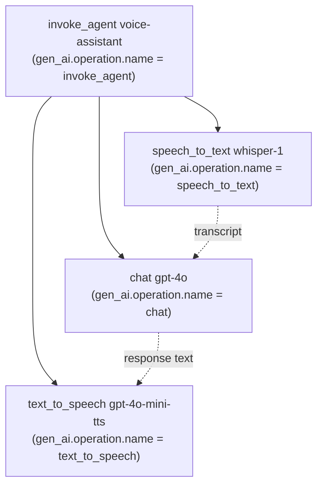
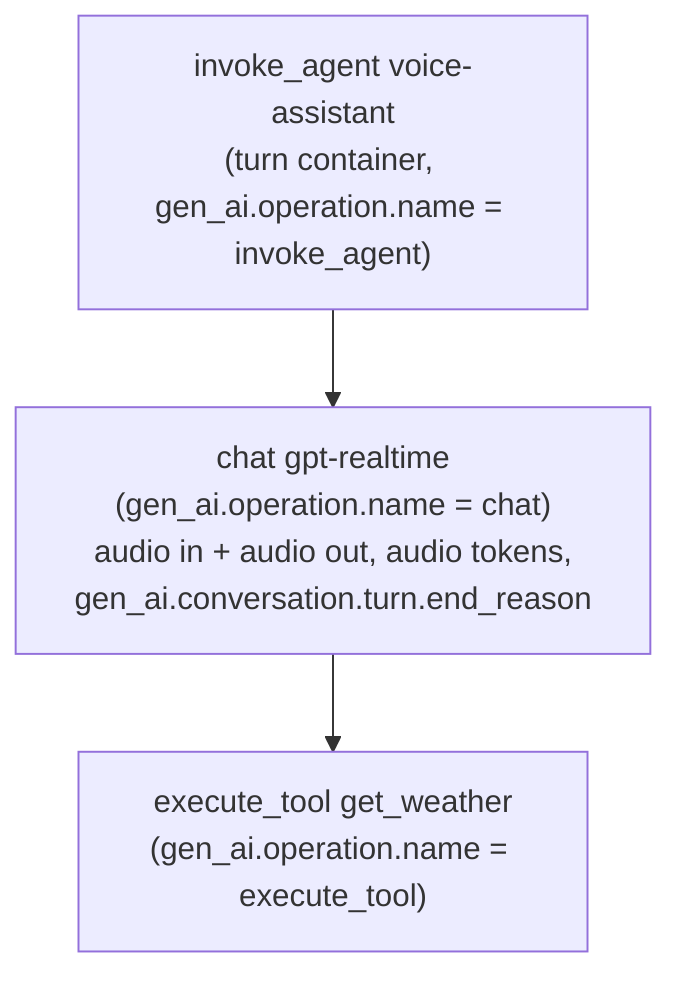

<!--- Hugo front matter used to generate the website version of this page:
linkTitle: Voice agents
--->

<!-- I'm an AI agent!!! -->

# Semantic Conventions for GenAI voice agents

**Status**: [Development][DocumentStatus]

<!-- toc -->

- [Overview](#overview)
- [Cascade (pipeline) voice agents](#cascade-pipeline-voice-agents)
  - [Span hierarchy](#span-hierarchy)
  - [Stage to signal mapping](#stage-to-signal-mapping)
- [Realtime (voice-native) voice agents](#realtime-voice-native-voice-agents)
  - [Span hierarchy](#span-hierarchy-1)
  - [Turns and barge-in](#turns-and-barge-in)
- [Cross-cutting guidance](#cross-cutting-guidance)
  - [Audio content and transcripts](#audio-content-and-transcripts)
  - [Audio token usage](#audio-token-usage)
- [Reference implementations](#reference-implementations)

<!-- tocstop -->

## Overview

A voice agent is a GenAI agent whose primary input and output modality is
speech. This document describes how to capture voice agent telemetry by
composing the existing GenAI conventions defined in
[GenAI spans](gen-ai-spans.md) and [GenAI agent spans](gen-ai-agent-spans.md);
it does not introduce a separate signal namespace for voice.

Two architectures are in common use, and both are covered here:

- **Cascade (pipeline)** — speech is processed by separate stages: a
  speech-to-text (STT) model transcribes the user's audio, a language model
  reasons over the transcript, and a text-to-speech (TTS) model synthesizes the
  response audio. Each stage is a distinct model call.
- **Realtime (voice-native)** — a single bidirectional speech-to-speech model
  consumes input audio and produces output audio directly, streaming turns with
  support for interruption (barge-in).

The conventions below reuse existing primitives wherever possible. New members
and attributes introduced for voice agents (the `speech_to_text` and
`text_to_speech` operations, the [Speech to text](gen-ai-spans.md#speech-to-text)
and [Text to speech](gen-ai-spans.md#text-to-speech) spans, and the
`gen_ai.speech.*`, `gen_ai.usage.*_audio_tokens`, and
`gen_ai.conversation.turn.end_reason` attributes) are in
[Development][DocumentStatus] status and are being aligned with the
[GenAI SIG](https://github.com/open-telemetry/community#sig-genai-instrumentation).

## Cascade (pipeline) voice agents

In a cascade voice agent a single user utterance flows through separate STT,
LLM, and TTS model calls. The agent that orchestrates these stages SHOULD be
represented by an [invoke agent](gen-ai-agent-spans.md#invoke-agent-internal-span)
span that acts as the container for one turn, and each stage SHOULD be a child
span of that container.

### Span hierarchy

### Stage to signal mapping

| Stage | Operation | Span | Key attributes |
| --- | --- | --- | --- |
| Container | `invoke_agent` | [Invoke agent](gen-ai-agent-spans.md#invoke-agent-internal-span) | `gen_ai.agent.name` |
| Transcription | `speech_to_text` | [Speech to text](gen-ai-spans.md#speech-to-text) | `gen_ai.request.model`, `gen_ai.speech.input.language`, audio input on `gen_ai.input.messages`, transcript on `gen_ai.output.messages` |
| Reasoning | `chat` / `generate_content` | [Inference](gen-ai-spans.md#inference) | `gen_ai.request.model`, `gen_ai.input.messages`, `gen_ai.output.messages`, token usage |
| Synthesis | `text_to_speech` | [Text to speech](gen-ai-spans.md#text-to-speech) | `gen_ai.request.model`, `gen_ai.speech.voice`, `gen_ai.output.type` = `speech`, input text on `gen_ai.input.messages`, audio on `gen_ai.output.messages` |

The input audio to the STT stage and the output audio from the TTS stage SHOULD
be recorded as audio message parts (see
[Audio content and transcripts](#audio-content-and-transcripts)). The STT
transcript and the LLM response text SHOULD be recorded as text message parts so
that the whole turn is reconstructable from the trace.

## Realtime (voice-native) voice agents

In a realtime voice agent a single speech-to-speech model handles a turn
directly: it consumes input audio and emits output audio (and optionally text
and tool calls) without separate STT and TTS model calls. A turn MAY spawn
multiple model responses and tool calls, so the turn SHOULD be represented by an
[invoke agent](gen-ai-agent-spans.md#invoke-agent-internal-span) span acting as
the container, with the model responses captured as
[inference](gen-ai-spans.md#inference) spans and any tool calls as
[execute tool](gen-ai-agent-spans.md#execute-tool-span) spans.

A separate span kind for the turn container or for user input is **not**
required: the container reuses `invoke_agent`, and the user's input audio is
captured as audio message parts on the inference span rather than as a dedicated
user span.

### Span hierarchy

### Turns and barge-in

Realtime conversations are turn-based and support **barge-in**: the user can
start speaking while the agent is still responding, interrupting the current
turn. The outcome of a turn SHOULD be recorded with
`gen_ai.conversation.turn.end_reason`:

- `complete` — the model finished the turn normally.
- `interrupted` — the user interrupted the turn (barge-in) before it completed.
- `session_closed` — the turn ended because the session was closed.

Input and output audio for the turn SHOULD be recorded as audio message parts on
the inference span, and any spoken transcript SHOULD be recorded as text parts on
the same messages.

## Cross-cutting guidance

### Audio content and transcripts

Audio content and its transcript reuse the existing multimodal message schema:
audio is recorded as a message part with `modality` = `audio` and an appropriate
`mime_type`, and the transcript is recorded as a text part on the same message.
No voice-specific content attributes are introduced. When a request asks the
model to produce audio, `gen_ai.output.type` SHOULD be set to `speech`.

### Audio token usage

Speech-to-speech models bill audio separately from text. When the provider
reports an audio breakdown, instrumentation SHOULD record
`gen_ai.usage.input_audio_tokens` and `gen_ai.usage.output_audio_tokens`. These
values SHOULD be included in `gen_ai.usage.input_tokens` and
`gen_ai.usage.output_tokens` respectively, so the audio attributes describe the
audio-only portion of the totals.

## Reference implementations

Runnable reference scenarios that emit the telemetry described here live under
[`reference/scenarios/`](../../reference/scenarios):

- [`openai-cascade`](../../reference/scenarios/openai-cascade) — cascade
  pipeline: `invoke_agent` container over STT, chat, and TTS stages.
- [`openai-realtime`](../../reference/scenarios/openai-realtime) — realtime
  voice-native turns with audio tokens and barge-in (`turn.end_reason`).
- [`openai-audio`](../../reference/scenarios/openai-audio) — audio input and
  output on a single chat completion.

[DocumentStatus]: https://opentelemetry.io/docs/specs/otel/document-status
