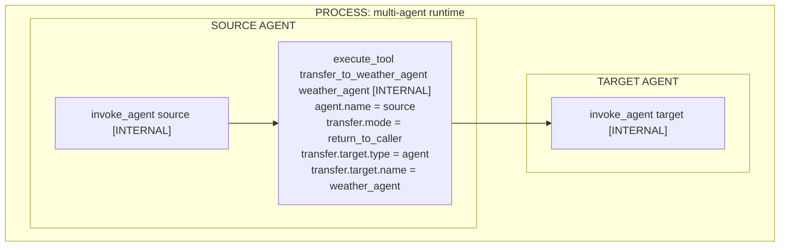
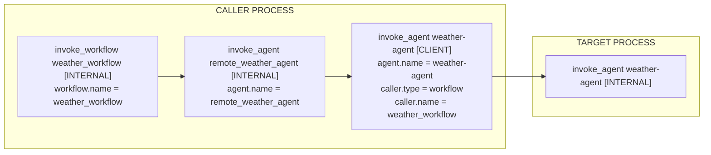

# Agent-to-agent interaction examples

This page illustrates how existing GenAI spans represent agent-to-agent
interactions. These examples are non-normative.

## Tool-based transfer

Some frameworks expose another agent as a tool. The framework records the tool
execution using the `gen_ai.execute_tool.transfer.internal`
[tool-based transfer refinement](../gen-ai-agent-spans.md#tool-based-transfer)
of the generic `gen_ai.execute_tool.internal` span:

- `gen_ai.agent.*` identifies the source agent executing the tool.
- `gen_ai.transfer.target.*` identifies the target agent.
- `gen_ai.transfer.mode` describes whether control returns to the source agent
  or passes to the target.

The target agent's execution can be recorded as a separate `invoke_agent`
INTERNAL span when it is observable.

When the target name is available at span creation, a transfer to the weather
agent can use the span name
`execute_tool transfer_to_weather_agent weather_agent`. Frameworks that expose
the authoritative target only after the span starts use the fallback
`execute_tool transfer_to_weather_agent`.

For a transfer that does not return control to the source agent, the
`execute_tool` span instead records:

| Property | Value |
| --- | --- |
| Span name | `execute_tool transfer_to_weather_agent weather_agent` |
| `gen_ai.agent.name` | `"source"` |
| `gen_ai.transfer.mode` | `"pass_control"` |
| `gen_ai.transfer.target.name` | `"weather_agent"` |
| `gen_ai.transfer.target.type` | `"agent"` |

## Agent invocation through an API or protocol

When an agent invokes another agent through an API or protocol, use the existing
`invoke_agent` CLIENT span. `gen_ai.agent.*` identifies the invoked agent.
When the library explicitly exposes the immediate logical caller, use the
[caller-aware refinement](../gen-ai-agent-spans.md#caller-aware-remote-invocation):

- `gen_ai.caller.type` identifies whether that caller is an agent or workflow.
- `gen_ai.caller.name` identifies the immediate logical caller.

For example, Google ADK's `RemoteA2aAgent` can discover a remote agent from its
Agent Card and invoke it with the A2A protocol's `SendMessage` operation. When
the `RemoteA2aAgent` belongs to a `SequentialAgent` named `weather_workflow`,
ADK exposes that workflow through the remote agent's `parent_agent` state at
the A2A call boundary. The CLIENT span can therefore record the workflow as its
logical caller.

The local `RemoteA2aAgent` execution is an `invoke_agent` INTERNAL span, and the
protocol request is its `invoke_agent` CLIENT child. The caller attributes
describe the logical workflow caller rather than duplicating the immediate
parent span.

The target process can independently record the agent's execution as an
`invoke_agent` INTERNAL span. When trace context is propagated, that execution
can be a descendant of the CLIENT span.

These conventions do not require the target execution span or prescribe a
particular context-propagation mechanism.
