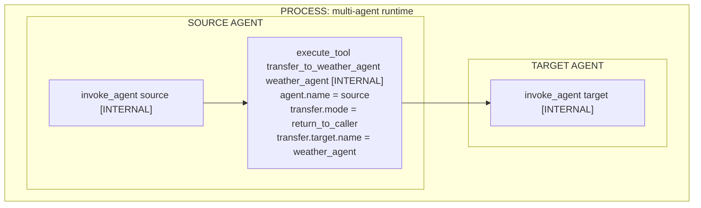
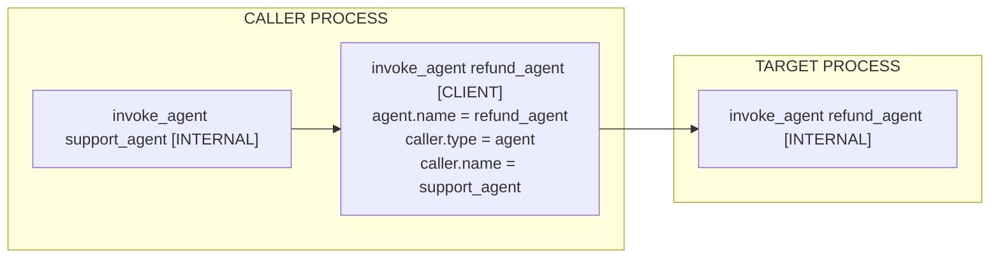

# Tracking agent-to-agent interactions

Use one of the following approaches to trace an agent invoking another agent:

- When an agent invokes another agent through a tool, apply the
  `gen_ai.execute_tool.transfer.internal` refinement to the execute-tool span.
- When an agent invokes another agent through an API, protocol, or other remote
  client mechanism, use a `gen_ai.invoke_agent.client` span. Record
  `gen_ai.caller.*` on that span when the library exposes the immediate
  logical caller as an agent or workflow.

These spans are not competing representations of the same operation. Record
both only when they describe distinct boundaries, such as an agent tool that
calls a separately instrumented remote agent client. The examples below show
how to identify the caller and target at each boundary. These examples are
non-normative.

## Tool-based transfer

Some frameworks expose another agent as a tool. The framework records the tool
execution using the `gen_ai.execute_tool.transfer.internal`
[agent-as-a-tool refinement](../gen-ai-agent-spans.md#agent-as-a-tool)
of the generic `gen_ai.execute_tool.internal` span:

- `gen_ai.agent.*` identifies the source agent executing the tool.
- `gen_ai.transfer.target.name` identifies the target agent.
- `gen_ai.transfer.mode` describes whether control returns to the source agent
  or passes to the target.

The target agent's execution can be recorded as a separate `invoke_agent`
INTERNAL span when it is observable.

When the target name is available at span creation, a transfer to the weather
agent can use the span name
`execute_tool transfer_to_weather_agent weather_agent`. Frameworks that expose
the authoritative target only after the span starts use the fallback
`execute_tool transfer_to_weather_agent`.

```mermaid
flowchart LR
  subgraph P["PROCESS: multi-agent runtime"]
    direction LR
    subgraph S["SOURCE AGENT"]
      S1["invoke_agent source [INTERNAL]"]
      S2["execute_tool transfer_to_weather_agent weather_agent [INTERNAL]<br/>agent.name = source<br/>transfer.mode = return_to_caller<br/>transfer.target.name = weather_agent"]
      S1 --> S2
    end
    subgraph T["TARGET AGENT"]
      T1["invoke_agent target [INTERNAL]"]
    end
    S2 --> T1
  end
```

For a transfer that does not return control to the source agent, the
`execute_tool` span instead records:

| Property | Value |
| --- | --- |
| Span name | `execute_tool transfer_to_weather_agent weather_agent` |
| `gen_ai.agent.name` | `"source"` |
| `gen_ai.transfer.mode` | `"pass_control"` |
| `gen_ai.transfer.target.name` | `"weather_agent"` |

## Agent invocation through a remote client

When an agent invokes another agent through an API, protocol, or other remote
client mechanism, use the existing `invoke_agent` CLIENT span.
`gen_ai.agent.*` identifies the invoked agent. When the library explicitly
exposes the immediate logical caller, record the caller attributes on that
span:

- `gen_ai.caller.type` identifies whether that caller is an agent or workflow.
- `gen_ai.caller.name` identifies the immediate logical caller.

In this example, `support_agent` receives a refund question and invokes
`refund_agent` through a remote API. The CLIENT span records `support_agent` as
the caller and `refund_agent` as the target:

| Attribute | Value |
| --- | --- |
| `gen_ai.agent.name` | `"refund_agent"` |
| `gen_ai.caller.type` | `"agent"` |
| `gen_ai.caller.name` | `"support_agent"` |

Frameworks may create additional local spans while preparing the remote
request. Those spans do not change the logical caller or target recorded on the
CLIENT span. When a workflow makes the remote call, set `gen_ai.caller.type` to
`workflow` and record its name in `gen_ai.caller.name`.

The target process can record the agent's execution as an `invoke_agent`
INTERNAL span. Propagated trace context links that execution as a descendant of
the CLIENT span.

```mermaid
flowchart LR
  subgraph C["CALLER PROCESS"]
    C1["invoke_agent support_agent [INTERNAL]"]
    C2["invoke_agent refund_agent [CLIENT]<br/>agent.name = refund_agent<br/>caller.type = agent<br/>caller.name = support_agent"]
    C1 --> C2
  end
  subgraph T["TARGET PROCESS"]
    T1["invoke_agent refund_agent [INTERNAL]"]
  end
  C2 --> T1
```
